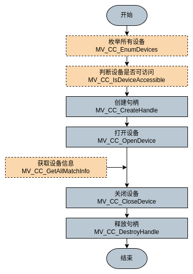
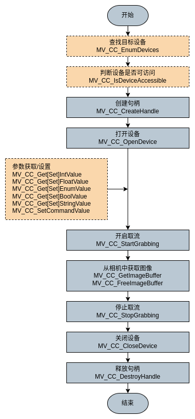
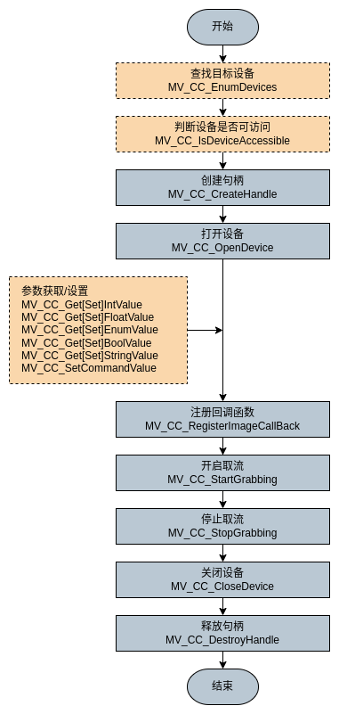

# 编程引导

本章节介绍了 C 接口取图流程和取图方式。获取图像有两种取流方式，分别为主动式取流和回调取流。

## 一、设备连接接口流程

对设备进行操作，实现图像采集、参数配置等功能，需要先连接设备（打开设备），具体流程如下图所示。

**详细步骤**

1.  （可选）调用 `MV_CC_EnumDevices()` 枚举子网内指定传输协议对应的所有设备。 可通过 `nTLayerType` 在结构 `MV_CC_DEVICE_INFO()` 中获取设备信息。 
2.  （可选）在打开指定设备前，调用 `MV_CC_IsDeviceAccessible()` 检查指定设备是否可访问。 
3.  调用 `MV_CC_CreateHandle()` 创建设备句柄。
4.  调用 `MV_CC_OpenDevice()` 打开设备。
5.  （可选）调用 `MV_CC_GetAllMatchInfo()` 以获取设备信息。 
6.  调用 `MV_CC_CloseDevice()` 关闭设备。 
7.  调用 `MV_CC_DestroyHandle()` 销毁句柄并释放资源。

 

## 二、主动取流流程

SDK 提供主动获取图像的接口，用户可以在开启取流后直接调用此接口获取图像，也可以使用异步方式（线程、定时器等）获取图像。

**主动获取图像有两种方式（两种方式不能同时使用）：**

方式一：调用 `MV_CC_StartGrabbing()` 开始采集，需要自己开启一个 buffer，然后在应用层循环调用 `MV_CC_GetOneFrameTimeout()` 获取指定像素格式的帧数据，获取帧数据时上层应用程序需要根据帧率控制好调用该接口的频率。

方式二：调用 `MV_CC_StartGrabbing()` 开始采集，然后在应用层调用 `MV_CC_GetImageBuffer()` 获取指定像素格式的帧数据，然后调用 `MV_CC_FreeImageBuffer()` 释放 buffer，获取帧数据时上层应用程序需要根据帧率控制好调用该接口的频率。

**主动取图方式使用的场景：**

主动取图方式需要先调用 `MV_CC_StartGrabbing()` 启动图像采集。上层应用程序需要根据帧率，控制好调用主动取图接口的频率。两种主动取图方式都支持设置超时时间，SDK 内部等待直到有数据时返回，可以增加取流平稳性，适合用于对平稳性要求较高的场合。

**两种主动取图方式的区别：**

a、`MV_CC_GetImageBuffer()` 需要与 `MV_CC_FreeImageBuffer()` 配套使用，当处理完取到的数据后，需要用 `MV_CC_FreeImageBuffer()` 接口将 pstFrame 内的数据指针权限进行释放。

b、`MV_CC_GetImageBuffer()` 与 `MV_CC_GetOneFrameTimeout()` 相比，有着更高的效率。且其取流缓存的分配是由 sdk 内部自动分配的，而 `MV_CC_GetOneFrameTimeout()` 接口是需要客户自行分配。

**注意事项：**

a、两种主动取图方式不能同时使用，且不能与后面的回调取图方式同时使用，三种取图方式只能使用其中一种。

b、pData 返回的是一个地址指针，建议将 pData 里面的数据 copy 出来另建线程使用。

**详细步骤**

1. （可选）调用 `MV_CC_EnumDevices()` 枚举子网内指定传输协议对应的所有设备。 可通过 `nTLayerType` 在结构 `MV_CC_DEVICE_INFO()` 中获取设备信息。
2. （可选）打开指定设备前，调用 `MV_CC_IsDeviceAccessible()` 检查指定设备是否可访问。 
3. 调用 `MV_CC_CreateHandle()` 创建设备句柄。 
4. 调用 `MV_CC_OpenDevice()` 打开设备。 
5. （可选）执行以下一个或多个操作以获取/设置相机不同类型的参数。 
   - 获取/设置 Int 类型节点值  调用 `MV_CC_GetIntValue()` / `MV_CC_SetIntValue()`
   - 获取/设置 Float 类型节点值  调用 `MV_CC_GetFloatValue()` / `MV_CC_SetFloatValue()`
   - 获取/设置 Enum 类型节点值  调用 `MV_CC_GetEnumValue()` / `MV_CC_SetEnumValue()`
   - 获取/设置 Bool 类型节点值  调用 `MV_CC_GetBoolValue()` / `MV_CC_SetBoolValue()`
   - 获取/设置 String 类型节点值  调用 `MV_CC_GetStringValue()` / `MV_CC_SetStringValue()`
   - 设置 Command 类型节点值  调用 `MV_CC_SetCommandValue()` 
6. 图像采集：
   - （可选）调用 `MV_CC_SetImageNodeNum()` 设置图像缓存节点个数。当获取的图像数超过这个设定值，最早的图像数据会被自动丢弃。
   - 调用 `MV_CC_StartGrabbing()` 开始取流。
   - 对于原始图像数据，可调用 `MV_CC_ConvertPixelType()` 转换图像的像素格式，也可调用 `MV_CC_SaveImage()` 转换成 JPEG 或 BMP 格式的图片，并保存成图片文件。
   - 在应用程序层中重复调用 `MV_CC_GetOneFrameTimeout()` 来获取图片数据。
7. 调用 `MV_CC_StopGrabbing()` 停止采集。 
8. 调用 `MV_CC_CloseDevice()` 关闭设备。 
9. 调用 `MV_CC_DestroyHandle()` 销毁句柄并释放资源。 

## 三、回调取流流程

SDK 提供注册回调函数的接口，用户可以将自己定义的回调函数注册在 SDK 内部，SDK 获取到相机图像会主动回调到应用程序供用户处理，此方式可以简化用户程序逻辑。

**回调取图方式使用场景：**

可以使用 `MV_CC_RegisterImageCallBackEx()` 接口注册回调函数。回调函数可以自定义，用于自动回调获取的图像。此方法可以简化应用程序逻辑。如果你想设置获取 RGB24 或 BGR24 格式的图像数据，也可以使用 `MV_CC_RegisterImageCallBackForRGB()` 或 `MV_CC_RegisterImageCallBackForBGR()` 来注册回调函数。

**注意事项：**

a、回调函数中不建议有耗时操作、线程锁等，容易造成回调阻塞。

b、pData 返回的是一个地址指针，建议将 pData 里面的数据 copy 出来另建线程使用。

**详细步骤**

1. （可选）调用 `MV_CC_EnumDevices()` 枚举子网内指定传输协议对应的所有设备。 可通过 `nTLayerType` 在结构 `MV_CC_DEVICE_INFO()` 中获取设备的信息。 
2. （可选）打开指定设备前，调用 `MV_CC_IsDeviceAccessible()` 检查指定设备是否可访问。 
3. 调用 `MV_CC_CreateHandle()` 创建设备句柄。 
4. 调用 `MV_CC_OpenDevice()` 打开设备。 
5. （可选）执行以下一个或多个操作以获取/设置相机不同类型的参数。
   - 获取/设置 Int 类型节点值  调用 `MV_CC_GetIntValue()` / `MV_CC_SetIntValue()` 
   - 获取/设置 Float 类型节点值  调用 `MV_CC_GetFloatValue()` / `MV_CC_SetFloatValue()`
   - 获取/设置 Enum 类型节点值  调用 `MV_CC_GetEnumValue()` / `MV_CC_SetEnumValue()`
   - 获取/设置 Bool 类型节点值  调用 `MV_CC_GetBoolValue()` / `MV_CC_SetBoolValue()`
   - 获取/设置 String 类型节点值  调用 `MV_CC_GetStringValue()` / `MV_CC_SetStringValue()`
   - 设置 Command 类型节点值  调用 `MV_CC_SetCommandValue()`
6. 图像采集：
   - （可选）调用 `MV_CC_SetImageNodeNum()` 设置图像缓存节点个数。当获取的图像数超过这个设定值，最早的图像数据会被自动丢弃。
   - 调用 `MV_CC_RegisterImageCallBack()` 来设置数据回调函数。
   - 调用 `MV_CC_StartGrabbing()` 开始采集。
   - 对于原始图像数据，可调用 `MV_CC_ConvertPixelType()` 转换图像的像素格式，也可以调用 `MV_CC_SaveImage()` 转换为 JPEG 或 BMP 格式图片，并保存成图片文件。
7. 调用 `MV_CC_StopGrabbing()` 停止采集。 
8. 调用 `MV_CC_CloseDevice()` 关闭设备。 
9. 调用 `MV_CC_DestroyHandle()` 销毁句柄并释放资源。 

